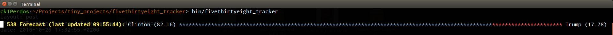

# FiveThirtyEight Tracker

A simple way of keeping tabs on the current state of the 2016 US Presidential polls.

This program will periodically poll the public API exposed by FiveThirtyEight.com and grab the latest information there about the state of the race.  



This program was written as an example of how to use [WebMock](https://github.com/bblimke/webmock) to stub external APIs while testing.

## Installation

Clone the repository to your local workstation:

```bash
git clone https://github.com/chriskottom/fivethirtyeight-tracker.git
```

Install the dependencies.  I like to put mine somewhere under the project directory like:

```bash
bundle install --path vendor/bundle
```

## Usage

You can run the tracker using the executable in the `bin/` directory:

```bash
bundle exec ./bin/fivethirtyeight_tracker
```

By default, the tracker will update the progress bar every 10 minutes (600 seconds).  You can change the refresh period by providing a numeric argument on the command line:

```bash
bundle exec ./bin/fivethirtyeight_tracker 60
```

Run the tests using the Rake test task provided:

```bash
rake test
```

## License

The gem is available as open source under the terms of the [MIT License](http://opensource.org/licenses/MIT).

